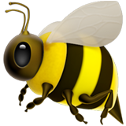

# 🐝 HoneyComb 蜜探智能探索工具

<div align="center">
  <br><br>
  <b>欢迎来到 HoneyComb！你的专属小蜜蜂智能采蜜团队 🌻</b>
  <p>还在苦苦搜寻资料吗？派出你的 AI 蜜蜂大军，帮你把全网的「知识花蜜」一滴不漏地带回蜂巢！</p>

  <p>
    🐝 <b>小蜜蜂</b> = 跑遍全网的情报采集员<br/>
    🍯 <b>花蜜</b> = 提炼出来的干货知识<br/>
    🏠 <b>知识蜂巢</b> = 会发光的魔法知识图谱<br/>
    👑 <b>蜂后</b> = 指挥大局的最强大脑<br/>
    🌻 <b>花田</b> = 各种好玩的信息源（arXiv、Reddit、GitHub...）
  </p>
</div>

---

## 🍯 看看我们的魔法

- **🌼 派蜜蜂去采蜜** — 告诉蜂后你想找什么花蜜，她会立刻为你规划采蜜路线！
- **🐝 聪明的蜂群** — 蜂后会根据采回来的花蜜，自己决定要不要派蜜蜂去寻找新的花田！
- **🏠 会长大的蜂巢** — 小蜜蜂们带回花蜜后，会一点点搭建出漂漂亮亮的六边形知识图谱（力导向可视化喔！）
- **📜 香甜采蜜报告** — 当蜂后觉得花蜜足够甜了，就会为你酿造一份超级详细的 HTML 采蜜报告！
- **💬 和蜂后聊天** — 你随时可以和蜂后聊聊她新发现的花田秘密~

## 🚀 开启寻花之旅

```bash
# 叫醒小蜜蜂们
npm install

# 打开蜂箱的门
npm run dev

# 戴上草帽，去花田看看
open http://localhost:3000
```

## 🌻 花田里的秘密

我们的小蜜蜂不会像无头苍蝇一样乱飞！它们有自己的采蜜魔法：

1. **听从蜂后指挥** — 蜂后 (AI) 会把你的愿望拆解成几个具体的采蜜方向
2. **小分队出击** — 小蜜蜂们兵分多路，同时去不同的花田（信息源）寻找花蜜
3. **尝尝味道** — 蜜蜂找到花粉后，会仔细品尝，只把最甜的精华带回来
4. **扩建蜂巢** — 把带回来的花蜜连在一起，搭建越来越大的知识图谱
5. **蜂后的智慧** — 蜂后会看着蜂巢想："哎呀，这块还没填满，再派几只蜜蜂去看看吧！"
6. **酿蜜** — 花蜜足够多的时候，蜂后就会开心地下令：停止采蜜，开始酿报告！

## 🎨 可可爱爱的设计

- **主色调**: 甜甜的蜂蜜金 `#FFC107`
- **UI 风格**: Q弹可爱风，圆角满满
- **视觉元素**: 六边形蜂巢 + 会呼吸的魔法节点
- **动态效果**: 扑棱翅膀的小蜜蜂、呼吸光晕、果冻弹跳

---

<div align="center">
  <b>🐝 Powered by HoneyComb — 就像蜜蜂采蜜一样自然~</b>
</div>
